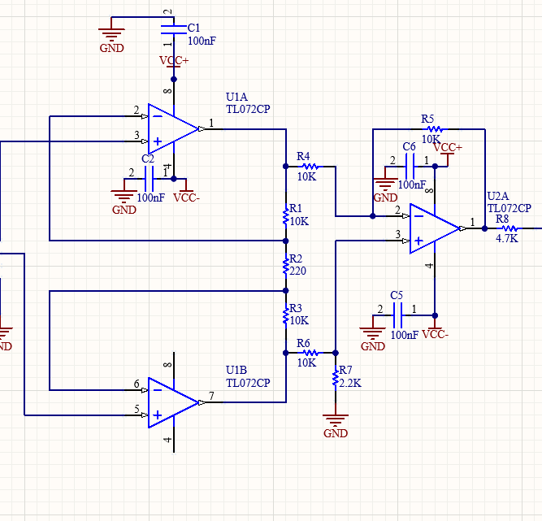
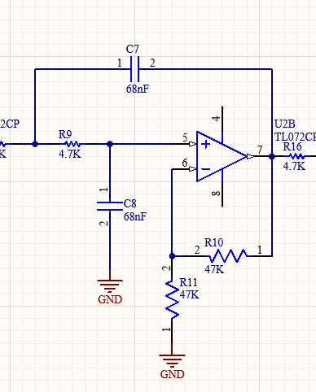
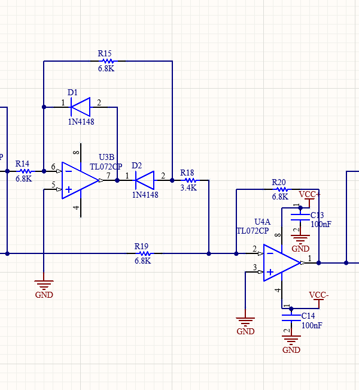
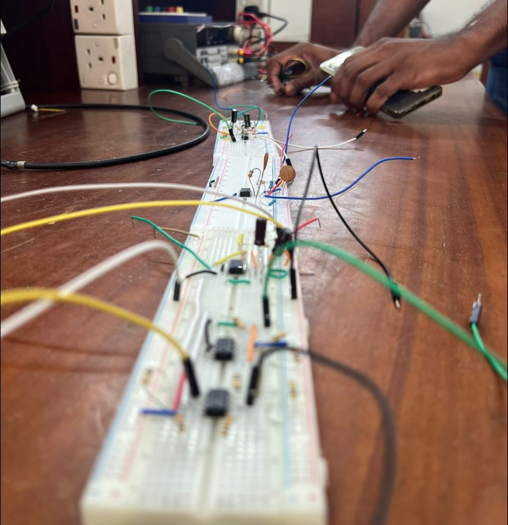
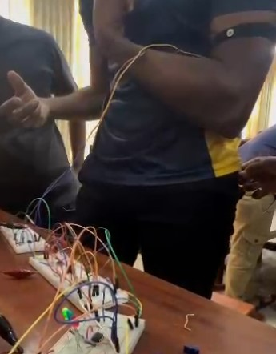
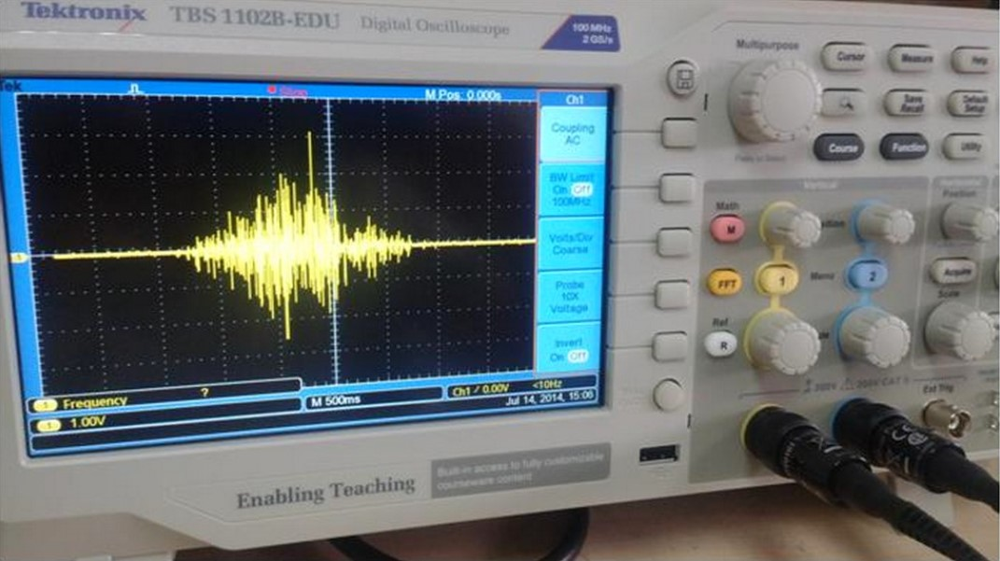

# EMG-Based Muscle Strength Indicator

This project is an **Electromyography (EMG)-based Strength Indicator** that visually represents muscle activation levels using LEDs. It uses dry electrodes, analog signal processing, and a comparator-driven LED display to give real-time muscle feedback. This is ideal for physiotherapy, prosthetics, sports analysis, and educational purposes.

---

## 📦 Features

- Real-time feedback of muscle activity  
- Signal conditioning with amplifier, filters, and rectifier  
- LED indication for strength levels  
- Affordable and beginner-friendly  
- Modular circuit design for easy learning

---

## 📊 Block Diagram

The system processes the EMG signal through several analog stages. Below is the text-based block diagram:

```
┌───────────────────────────────┐
│  Input Muscle Activity Signal │
└─────────────┬─────────────────┘
              │
┌─────────────▼─────────────────┐
│     Instrumentation Amplifier │
└─────────────┬─────────────────┘
              │
┌─────────────▼─────────────────┐
│  Second Order Low Pass Filter │ (1)
└─────────────┬─────────────────┘
              │
┌─────────────▼─────────────────┐
│  Second Order Low Pass Filter │ (2)
└─────────────┬─────────────────┘
              │
┌─────────────▼─────────────────┐
│ Full Wave Precision Rectifier │
└─────────────┬─────────────────┘
              │
┌─────────────▼─────────────────┐
│       Voltage Comparator      │
└─────────────┬─────────────────┘
              │
┌─────────────▼─────────────────┐
│     Output Levels of LEDs     │
└───────────────────────────────┘
```

> *Figure 1: Block Diagram of the Device*

---

## 🔌 Circuit Diagram

This project consists of three major analog circuit stages:

### 1. INA128 Instrumentation Amplifier  
Amplifies the differential EMG signals from the electrodes.



---

### 2. Sallen-Key Low-Pass Filter  
Filters out high-frequency noise from the amplified EMG signal.



---

### 3. Full-Wave Precision Rectifier  
Converts the AC EMG signal into a unipolar (positive-only) signal suitable for LED comparison.



---

## 🔨 Breadboard Layout

The layout below shows how to implement the circuit on a breadboard for prototyping.



> 💡 Tip: Keep analog signal lines short and use a common ground for all modules.

---

## 📷 Subject & EMG Signal

<table>
  <tr>
    <td align="center">
      <strong>Subject</strong><br>
      
    </td>
    <td align="center">
      <strong>EMG Signal</strong><br>
      
    </td>
  </tr>
</table>

---

## 🧪 Applications

- **Physiotherapy:** Muscle engagement monitoring for rehab patients  
- **Prosthetics:** Detect muscle signals to trigger movement  
- **Sports Science:** Analyze muscle performance during exercise  
- **Education:** Demonstrates core bio-signal processing concepts

---


## 💡 Future Improvements

- Add digital signal processing (DSP) features  
- Include wireless (e.g., Bluetooth) feedback to a mobile app  
- Use machine learning to classify muscle patterns

---


